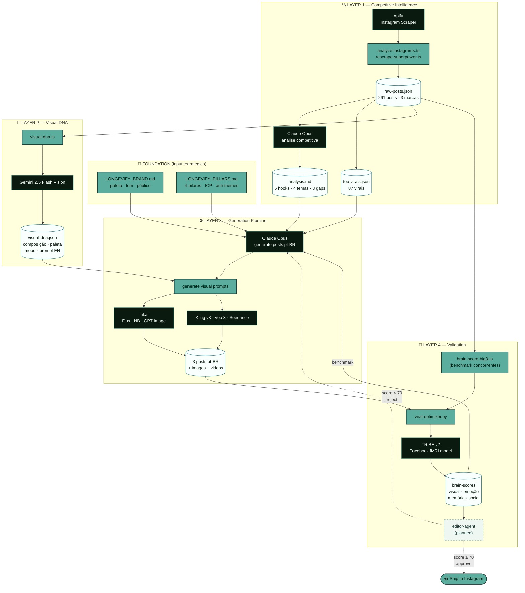

# Longevify Content Machine — Workflow

> **Como ver:** abre esse arquivo em qualquer markdown viewer com suporte Mermaid (VS Code, GitHub, Notion). Ou cola o bloco mermaid em [mermaid.live](https://mermaid.live) pra fullscreen.

---

## Visão geral — 4 camadas



---

## Status por componente

| Camada | Componente | Status | Arquivo |
|--------|-----------|--------|---------|
| **Foundation** | Brand book | ✅ | `LONGEVIFY_BRAND.md` |
| **Foundation** | Content pillars | ✅ | `LONGEVIFY_PILLARS.md` |
| L1 | Scrape Apify | ✅ | `scripts/analyze-instagrams.ts` |
| L1 | Re-scrape per brand | ✅ | `scripts/rescrape-superpower.ts` |
| L1 | Claude analysis | ✅ | `scripts/analyze-instagrams.ts` |
| L2 | Visual DNA Gemini | ✅ rodando agora | `scripts/visual-dna.ts` |
| L3 | Pipeline orquestrador | ✅ | `pipeline.ts` |
| L3 | Generate posts | ✅ | `pipeline.ts` (step 3) |
| L3 | Generate visual prompts | ✅ | `pipeline.ts` (step 4) |
| L3 | fal.ai images | ✅ | `pipeline.ts` (step 5) |
| L3 | Vídeo (Kling/Veo/Seedance) | ✅ opt-in | `pipeline.ts` (step 6) |
| L4 | Brain-score solo | ✅ | `scripts/viral-optimizer.py` |
| L4 | Brain-score Big 3 | ✅ rodando agora | `scripts/brain-score-big3.ts` |
| L4 | Editor agent (gate) | ⏳ planned | — |

---

## O que falta integrar

1. **Plugar `LONGEVIFY_PILLARS.md` no `pipeline.ts`** — hoje só `BRAND.md` é injetado em generate-posts. 5 linhas de mudança.
2. **Editor agent** — gate de qualidade entre `generate posts` e `Ship`. Lê pillars + brand + score, devolve aprovado/reprovado com correções específicas.
3. **Loop de feedback `brain-score → generate-posts`** — usar score do Big 3 como benchmark; gerar posts até score ≥ benchmark.

---

## Comandos rápidos

```bash
cd Brand/Longevify/content-machine

# Layer 1
npm run analyze-instagrams                    # scrape + ranqueia + Claude analysis
node ... rescrape-superpower.ts <dir>         # re-scrape uma marca com limite alto

# Layer 2
npm run visual-dna                            # virais das 3 marcas
npm run visual-dna -- --brand=Superpower      # todos os posts de uma marca

# Layer 3
npm run                                       # pipeline completa (gera posts + img)
GENERATE_VIDEO=true npm run                   # com vídeo

# Layer 4
npm run brain-score -- caminho/asset.png      # uma asset
npm run brain-score-big3                      # benchmark dos concorrentes (top 5/marca)
```
